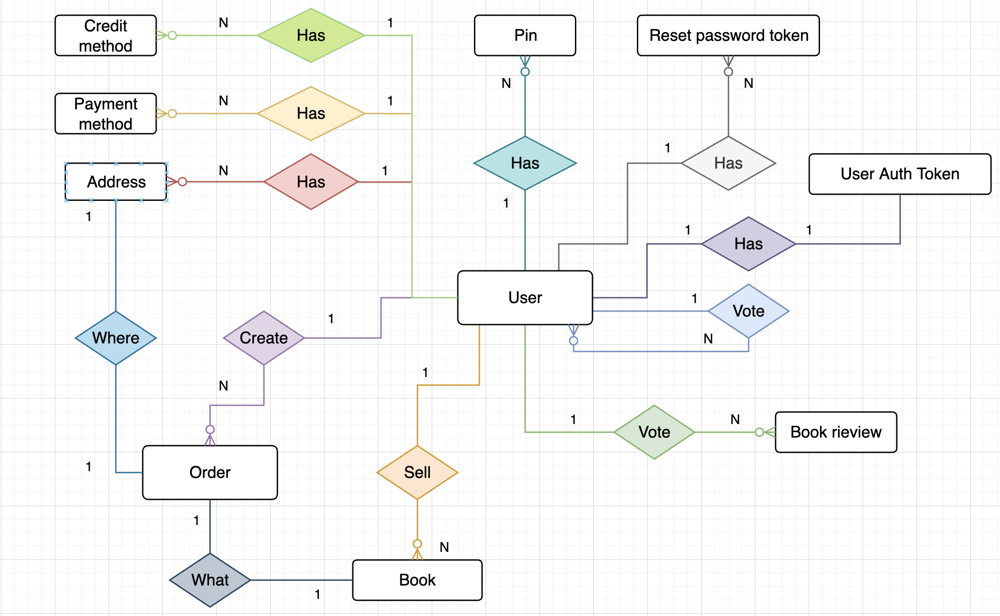
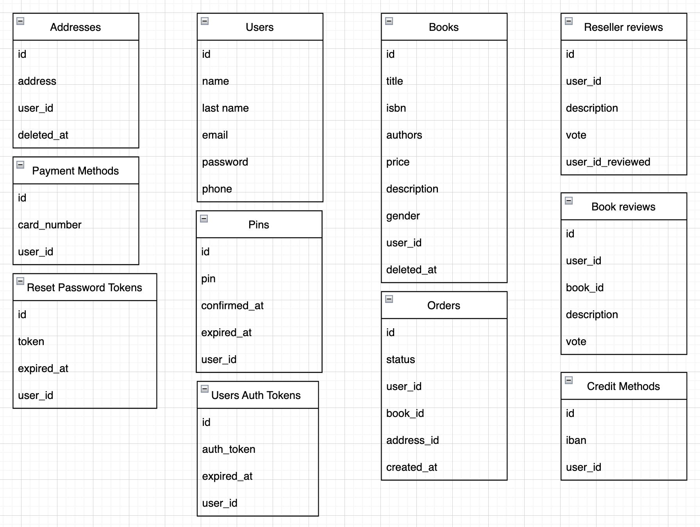

# 🕸️ Schema ER

Di seguito è rappresentato lo schema ER con tutte le entità e relazioni da modellare nell’applicazione. Come si può notare non sono presenti gli attributi delle singole entità in modo da non complicare ulteriormente lo schema: si è preferito dare importanza alle singole entità e alle relazioni tra di loro. Gli attributi saranno rappresentati in seguito nello schema delle tabelle della base di dati.

La rappresentazione in tabelle della base di dati è la seguente:

Si è scelto di introdurre l’attributo `deleted_at` sulla tabella `addresses` e sulla tabella `books` perchè, siccome sono collegati tramite chiave esterna alla tabella `orders`, in caso di cancellazione di un indirizzo rimane comunque il riferimento nell’ordine effettuato.

Per quanto riguarda la tabella `books`, se il venditore elimina un libro che è presente in vari ordini, verrà eliminato dalla tabella `books` andando a impostare la data di `deleted_at`, in questo modo nella tabella `orders` ci sarà sempre il riferimento al libro venduto. Questo approccio verrà implementato lato back-end tramite la funzionalità **SoftDeletes.**

Di seguito c’è una breve descrizione per ogni tabella:

- `Users`: contiene le informazioni in merito all’utente che si registra alla piattaforma, in particolare il campo password contiene l’HASH della password.
- `Addresses`: contiene gli indirizzi dei vari utenti registrati.
- `Payment methods`: contiene i codici delle carte di credito delle persone, utilizzate per poter acquistare dei libri.
- `Credit methods`: contiene l’IBAN delle persone per poter ricevere il pagamento della vendita del libro.
- `Reset Password Tokens`: contiene i vari token che sono generati quando un utente richiede il reset della password. Il token avrà una scadenza di un’ora e sarà utilizzato poi per poter estrapolare le informazioni dell’utente che richiederà la password.
- `Pins`: contiene l’elenco dei PIN che saranno generati e mandati all’utente. Ogni PIN avrà una scadenza e nel momento in cui l’utente conferma il numero di telefono tramite il PIN valido verrà aggiunta la data attuale nella colonna `confirmed_at`.
- `Books`: contiene le varie informazioni in merito al singolo libro. Il campo descrizione conterrà un generica descrizione del libro, quale per esempio le condizioni in cui si trova (nuovo, ecc).
- `Reseller Reviews`: contiene le recensioni che gli utenti danno ai vari venditori dopo che hanno acquistato un loro libro, con un voto che andrà da 1 a 5 e una descrizione opzionale.
- `Book Reviews`: contiene le recensioni dei vari libri che sono stati acquistati da un’utente, con un voto che andrà da 1 a 5 e una descrizione opzionale.
- `Users Auth Tokens`: contiene i token di autenticazione al back-end dei vari utenti. I token vengono generati ogni volta al login e hanno una durata di 1 giorno. Per poter utilizzare il back-end i token devono essere passati come Bearer Token nel header Authorization della richiesta HTTP.
- `Orders`: contiene i dettagli del singolo ordine, in particolare contiene il riferimento di chi ha effettuato l’ordine (`user_id`), di cosa ha acquistato (`book_id`) e dove deve essere consegnato (`address_id`).
C’è anche un’indicazione dello stato in cui si trova l’ordine in modo da sapere sempre in che situazione si trova. Lo stato può essere per esempio:
    - `pending`: in questo stato quando l’ordine è stato appena creato ed è in attesa che arrivi il pagamento;
    - `processing`: ci si trova in questo stato quando l’ordine è stato pagato e il venditore si deve occupare della spedizione;
    - `shipped`: ci si trova in questo stato quando l’ordine è stato spedito al destinatario;
    - `delivered`: l’ordine è arrivato a destinazione e l’acquirente segnala che il pacco è arrivato;
    - `done`: quando il pagamento sarà versato al venditore, l’ordine è da considerare completato.
    
    Infine nella tabella `orders` c’è un riferimento alla tabella `books`, questo significa che se il venditore deve modificare il prezzo di un libro che è già stato acquistato da altre persone il prezzo cambierebbe anche per le persone che hanno già pagato. Per far fronte a questa problematica si è deciso che ogni volta che il venditore modifica qualche attributo di un libro, come per esempio il prezzo, dietro le quinte si andrà ad eliminare il libro che deve essere modificato e si andrà a creare un nuovo elemento con l’attributo aggiornato, in questo modo tutti i libri che sono già presenti nei vari ordini non subiscono alcuna variazione.