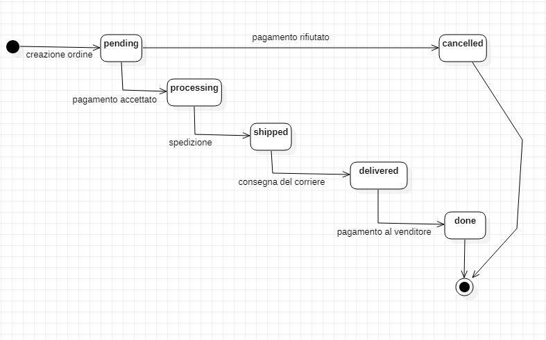

# Macchina a stati

Di seguito viene rappresentata la state machine riguardante lo stato di avanzamento di un ordine.

Nel suo ciclo di vita, un ordine si può trovare nei seguenti stati:

- `pending`: l’ordine è stato appena creato; si è in attesa del pagamento;
- `processing`: il pagamento dell’ordine è stato accettato; il venditore si deve occupare della spedizione;
- `cancelled`: l’ordine è stato annullato a causa del rifiuto del pagamento (ad es. saldo insufficiente sulla carta indicata come metodo di pagamento);
- `shipped`: l’ordine è stato spedito al destinatario;
- `delivered`: l’ordine è arrivato a destinazione e l’acquirente ha segnalato che il pacco è arrivato;
- `done`: il pagamento è stato versato al venditore: l’ordine è da considerare completato.
