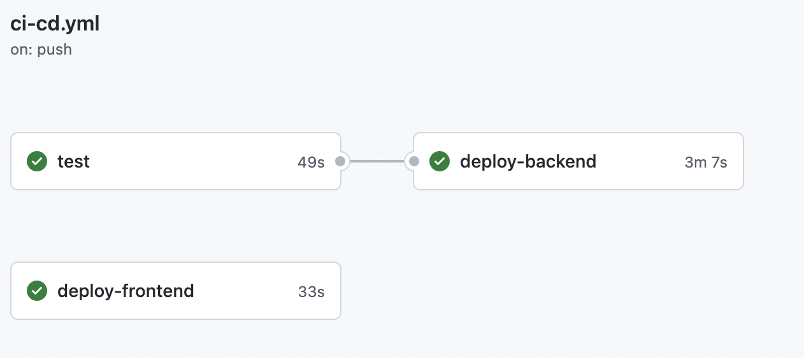

# 🧪 Software testing @Domenico Gaeni

Durante lo sviluppo del back-end sono stati implementati dei test statici e dei test di unità.

### Test statici

Per i test statici si è utilizzata la libreria `Psalm` ([documentazione](https://psalm.dev/)) che offre una serie di test statici che vanno a verificare la corretta stesura del codice php in tutto il progetto.

Per esempio di seguito si commentano alcuni esempio di test statici che danno errore:

```php
<?php

/**
 * @return array<string>
 */
function takesAnInt(int $i) {
    return [$i, "hello"];
}

$data = ["some text", 5];
takesAnInt($data[0]);
```

- Nel primo caso il test darà errore perché nella `PHPDOC` è dichiarato che la funzione ritorni un array di stringhe mentre nella realtà ritorna un array con un intero e una stringa.
- Nel secondo caso ci sarà un errore perché una stringa viene passata come parametro ad una funzione che si aspetta un intero.

In conclusione si può dire che i test statici si assicurano che non ci siano sviste da parte del programmatore e che il codice è scritto rispettando la sintassi.

### Test d’unità

Oltre ai test statici sono stati scritti anche dei test ad hoc per verificare la validità di tutte le chiamate esposte. Per questa tipologia di test si è utilizzata la libreria `PHPUNIT` ([documentazione](https://phpunit.readthedocs.io/en/9.5/)).

I test sono scritti all’interno della directory: `back-end/tests/`.

Per poter funzionare nel modo migliore i test hanno bisogno di dati sui quale poter fare le varie operazioni. Senza scrivere nel codice i dati fissi, si può utilizzare un generatore di dati fake in modo che ogni volta cambiano, rispettando però un pattern definito a priori.

Lumen mette a disposizione la libreria `FakerPHP/Faker` ([link alla repo](https://github.com/FakerPHP/Faker/)) che permette di generare dei dati fake a seconda delle necessità. Se per esempio devo generare un nome e una email posso fare così:

```php
<?php
require_once 'vendor/autoload.php';

// use the factory to create a Faker\Generator instance
$faker = Faker\Factory::create();
// generate data by calling methods
echo $faker->name();
// 'Vince Sporer'
echo $faker->email();
// 'walter.sophia@hotmail.com'
```

All’interno della directory: `/back-end/database/factories` sono presenti le varie classi associate alle tabelle del database nel quale sono definite le regole per la generazione di dati. In questo modo quando si avrà bisogno di una certa entità per poter eseguire i test posso crearla con dati fake che cambiano ogni volta, andando a “simulare” i dati reali.

Ogni test scritto verifica che le chiamate esposte al pubblico rispettino il comportamento atteso, testando il tutto sia in caso di successo ma anche in caso di errore.

Per esempio di seguito è descritto il test per la verifica della chiamata per la _creazione di un nuovo utente_:

```php
public function testNewUser()
    {
				// Viene generato un nuovo utente con dati fake.
        $user = User::factory()->raw();
        $name = $user['name'];
        $lastName = $user['last_name'];
        $email = $user['email'];
        $password = $user['password'];
        $phone = $user['phone'];
				// Viene generato un indirizzo.
        $address = Address::factory()->raw()['address'];
				// Viene generata una carta di credito.
        $cardNumber = PaymentMethod::factory()->raw()['card_number'];
				// Viene generata un iban.
        $iban = CreditMethod::factory()->raw()['iban'];

				// Controlliamo che sul database nella tabella users non sia presente
				// un utente con lo stesso nome, cognome, email e telefono.
        $this->notSeeInDatabase('users', [
            'name' => $name,
            'last_name' => $lastName,
            'email' => $email,
            'phone' => $phone,
        ]);

				// Chiamamo la richiesta di creazione di un nuovo utente,
				// passando le varie informazioni.
        $this->post('auth/register', [
            'name' => $name,
            'last_name' => $lastName,
            'email' => $email,
            'password' => $password,
            'phone' => $phone,
            'address' => $address,
            'card_number' => $cardNumber,
            'iban' => $iban,
        ]);
				// Verifichiamo che la richiesta ritorni codice 200 (tutto ok)
        $this->seeStatusCode(200);
        $response = json_decode($this->response->original)->data;

				// Verifichiamo il formato e il contenuto della risposta
				// che viene ritornata alla chiamata.
        $this->seeJson([
            'data' => [
                'id' => $response->id,
                'name' => $name,
                'last_name' => $lastName,
                'email' => $email,
                'phone' => $phone,
                'address' => $address,
                'auth_token' => [
                    'auth_token' => $response->auth_token->auth_token,
                    'expired_at' => $response->auth_token->expired_at,
                ],
                'card_number' => $cardNumber,
                'iban' => $iban,
            ],
        ]);

				// Infine controlliamo che nel database sia presente l'utente
				// con i dati corretti che abbiamo generato.
        $this->seeInDatabase('users', [
            'name' => $name,
            'last_name' => $lastName,
            'email' => $email,
            'phone' => $phone,
        ]);
    }
```

### CI / CD

Infine abbiamo implementato una Github action (`/.github/workflows/ci-cd.yml`) che esegue ad ogni push/merge sul branch master i seguenti tre job:



- `test`: Questo job è necessario per poter fare il deploy del backend correttamente, infatti esegue in un ambiente di test dedicato i vari test, sia _statici_ con `psalm` e _sia di unità_. Nell’ambiente di test vengono inizializzate tutte le tabelle e grazie poi ai dati fake si è in grado di eseguire i vari test in modo semplice. Se tutti i test sono corretti e non ci sono problemi allora si procede con il deploy del backend.
- `deploy-backend`: viene buildata l’immagine Docker di produzione con tutto il codice e poi viene deployato su Heroku.
- `deploy-frontend`: viene caricato tutto il codice relativo alla parte del front-end su Heroku che verrà esposto poi tramite NodeJS.

Avendo implementato un meccanismo di _continuous integration_, se un domani qualcuno mette mano al codice del back-end e rompe qualcosa, nel momento in cui viene eseguita la Github action e i test falliscono nulla viene deployato in produzione, garantendo sempre il funzionamento di tutto quello presente sul branch `master`.
